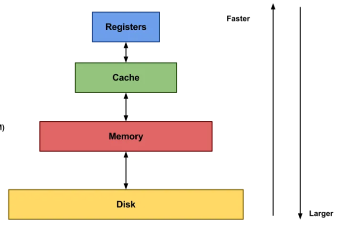

# Chapter 2 - 1 컴퓨터 구조의 큰 그림

## 컴퓨터의 핵심 부품
- CPU : 정보를 읽어들이고, 해석하고, 실행하는 부품
  - ALU(산술논리연산장치) : 실제로 연산을 수행하기 위한 회로로 구성
  - CU(제어장치) : 명령어를 해석하고, 제어 신호를 보내 부품을 작동시키는 장치
  - Register(레지스터) : CPU 내부 작은 임시 저장장치, 데이터와 명령어를 처리하는 과정 중간값 저장.
- 메모리 : 실행중인 프로그램을 구성하는 데이터와 명령어를 저장
  - 일반적으로 메인 메모리는 RAM을 말한다.
    - CPU가 원하는 정보로 접근하기 위해서는 "주소"가 필요하다. 
    - 휘발성 : 전원이 공급되지 않읗 때, 저장중인 정보는 지워진다.
  - 캐시 메모리 : CPU가 조금이라도 더 빨리 메모리에 저장된 값에 접근하기 위해 사용하는 저장 장치이다.
- 보조기억장치 : 비휘발성! 저장장치 (하드디스크, SSD, USB 등) -> 보관할 프로그램을 저장
  - 추후 RAID에 대해 학습 / 안전하고 안정적으로 보조기억장치를 구현하기 위함임.
- 입출력장치 : 컴퓨터 외부에 연결되어 컴퓨터 내부와 정보 교환.

- 메인보드 / 버스
  - 메인보드 : 핵심 부품들을 고정하고 연결하는 기판. 
  - 버스 : 각 컴퓨터 부품들이 정보를 주고 받는 통로 (EX - 시스템 버스) 

### Remarks. 저장 장치의 계층 구조
- 일반적으로, CPU와 가까울 수록 빠르고, 멀리 있을 수록 느리다.
- 속도가 빠르면 용량이 작고 비싸다.

  