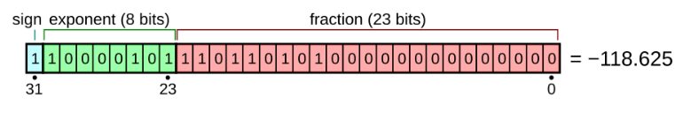

# Chapter 2 - 2 컴퓨터가 이해하는 정보

## 2진법으로 수 표현하기
- 기본적으로 CPU는 0과 1만을 이해할 수 있어, 2진법을 사용해야 함.
- 이런 2진법은, 표현하려는 숫자의 길이가 너무 길어지는 단점 보유
  - 16진법도 함께 사용함 (hexadecimal)
  - 10이 넘어가면 10, 11, 12, 13, 14, 15를 A, B, C, D, E, F로 표기.
  - 16진수 앞에 0x를 붙여 구분한다.
  - MAC주소나 IPv6 주소를 표현시 사용한다.

### 부동 소수점과 IEEE754 (중요 개념!!!)

```
a = 0.1
b = 0.2
c = 0.3

if a + b == c:
    print('equal')
else:
    print('not equal')
```
- 위의 결과는 놀랍게도 not equal!이다.
- 부동소수점 방식의 한계에 의한 오차
  - 부동 소수점(floating point) : 소수점이 고정되어 있지 않은 소수 표현 방식.
  - 필요시에 따라 소수점 이동이 가능하다.
- 2진수 체계에서 소수는 m * 2^n의 형태로 표시한다. 
  - 예시 : 1101011.1010101 이런 수를 1.1010111010101 * 2^6 등으로 표시. 근데, 지수를 수정할 수 있음!

#### IEEE754



- 부호 비트는 0이면 양수, 1이면 음수
- 변환을 원하는 수를 절대값으로 변환하여 일단 2진법 변환
- 소수점을 왼쪽으로 이동시켜, 왼쪽에 1만 남게 즉 1.xxxxx * 2^N 이런 식으로 형태.
  - fraction part(가수부)의 정수부를 1로 통일시킨다는 의미로, 정규화한 수를 저장한다.
  - 즉 지수부 N과, 소수부를 저장한다.
- 지수를 저장할 때에는 바이어스를 더한다.
  - k비트가 지수부의 비트일 때 바이어스의 값 = 2**(k-1) - 1
  - IEE754는 8비트의 지수이므로 바이어스의 값 127을 더한다.
- 10진수 소수를 2진수로 표현시, 10진수 소수와 2진수 소수는 표현이 맞지 않을 수 있다.


## 2진법으로 문자 표현하기 - 뷁뛟쌟이 일어나는 이유는?
- 문자 인코딩 : 0과 1로 이루어진 문자 코드로 변환하는 과정
- 문자 디코딩 : 0과 1로 표현된 문자를 사람이 이해하게 만드는 과정
- 즉 뷁문자가 터졌다 = 웹사이트가 특정 인코딩을 지원하지 않거나, 디코딩 하는 방법을 알지 못할 때 발생

### ASCII
- 가장 기본적인 문자 집합 : 영어 알파벳, 숫자, 일부 특수문자.
- 8비트 중 1비트는 패리티 비트로 오류 검출에 사용, 7비트로 128개의 문자 표현
  - EX/ A : 10진수 65, 2진수 1000001   a : 10진수 97  2진수 1100001
- 아스키 코드는 한글 표현 불가

### EUC-KR
- 아스키 문자는 1바이트, 한글은 2바이트
  - 2바이트는 16비트, 4자리 16진수로 표현 가능.
  - EX/ 한 : 0xc7d0

'''
a = '한'.encode('euc-kr')
b = '글'.encode('euc-kr')
print(a.hex())
print(b.hex())
'''
- 진짜 괴상한 한글 (쀓) 같은 글자는 표현이 불가..

### 유니코드
- 한글 뿐만 아니라 다양한 언어, 특수문자, 이모지 등 까지 되는 통일된 문자 집합
'''
a = hex(ord('한'))
b = hex(ord('글'))
print(a)
print(b)
'''
- Remark. U+D55C 식으로 +가 붙은 것은 16진수 유니코드

#### UTF-8, UTF-16, UTF-32
- 유니코드는 글자에 부여된 값을 인코딩 하는 것이 아님
- 글자에 부여된 그 값을 한번 더 인코딩함.
- utf-8, 16, 32에 따른 가변 길이 인코딩 방식
  
### base64
- 문자 뿐만 아니라, 이진 데이터 까지 변환할 수 있는 인코딩 방식
- 64진법 기반
- 4개씩(24비트) 한번에 변환, 부족한 자리는 0으로 채워지는 패딩

## 명령어
- 명령어 = 연산코드(수행할 동작) + 오퍼랜드(대상, 데이터가 저장된 위치)
- 연산코드 -> 데이터 전송, 산술/논리연산, 제어/흐름 변경, 입출력 제어
- 기계어 vs 어셈블리어
  - 기계어 : 0과 1로만 이루어진 데이터/명령어
  - 어셈블리어 : 0과 1로만 표현되 기계어를 읽기 편한 형태로 단순 번역 (CPU가 이해하는 동작 파악 가능)